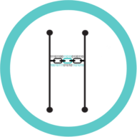
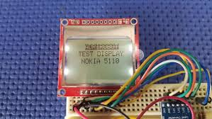
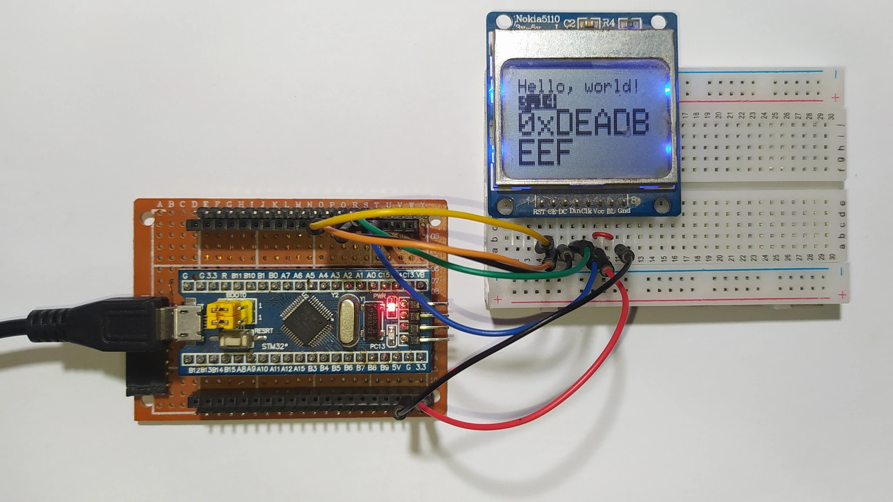
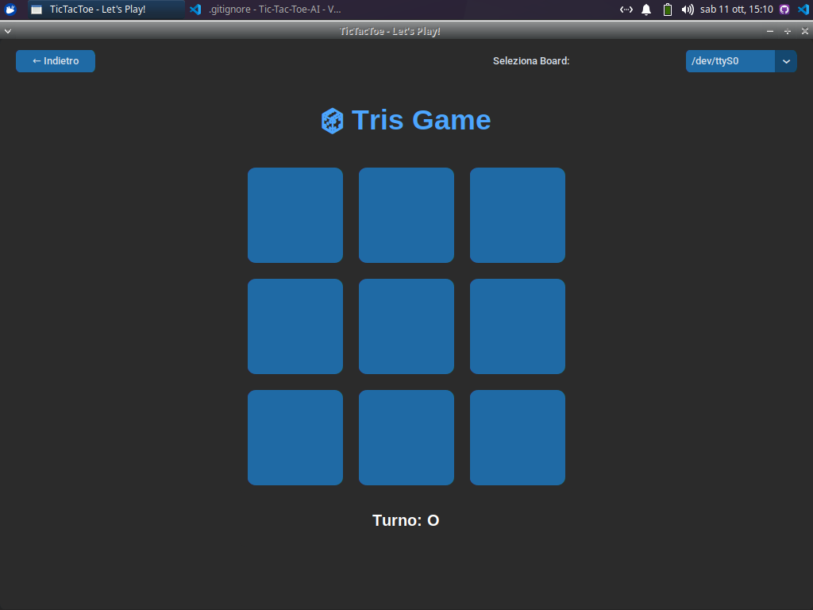

---

# ❌⭕ Tic-Tac-Toe Game with AI

<div align="center">


<!-- Logos aligned horizontally -->



</div>

A fully embedded **Tic-Tac-Toe game** developed for **STM32 microcontrollers**, supporting both **Human vs AI** gameplay.
The project leverages **UART communication** for player interaction and features an **AI agent** capable of making strategic moves with simulated decision latency.

---

## 🧠 Project Overview

This repository showcases a minimal yet functional **AI-driven Tic-Tac-Toe game** running directly on STM32 hardware.
It demonstrates how embedded systems can implement logic-based gameplay through serial communication and modular firmware design.

The project is ideal for:

* Demonstrating **embedded AI logic**
* Practicing **UART communication**
* Integrating **human-machine interaction** in firmware projects

---

## 📑 Table of Contents

1. [Introduction](#-introduction)
2. [Hardware Requirements](#-hardware-requirements)
3. [Software Requirements](#-software-requirements)
4. [Setup Instructions](#️-setup-instructions)

   * [Hardware Setup](#1-hardware-setup)
   * [Software Setup](#2-software-setup)
5. [How to Play](#how-to-play)
   * [Core Game Logic](#core-game-logic)
   * [UART Communication](#uart-communication)
   * [AI Logic](#ai-logic)
   * [Timing and Performance](#timing-and-performance)
7. [Example Output](#example-output)
8. [License](#license)

---

## 🧩 Introduction

The **Tic-Tac-Toe AI Game** is a firmware-level implementation of the classic 3x3 game, designed for STM32 boards.
It allows interaction via a **serial terminal (UART)**, where users input coordinates to place their mark.
The AI uses a **predefined move-selection algorithm**, adding a realistic delay to simulate computational thought.

The game flow:

1. Display the board on the terminal
2. Wait for user input (e.g., `a1`, `b3`)
3. Compute and print the AI move
4. Continue until a winner is found or a draw occurs

---

## 🔧 Hardware Requirements

| Component                 | Description                                 |
| ------------------------- | ------------------------------------------- |
| **STM32 Microcontroller** | Recommended: STM32F4 series (or equivalent) |
| **USART Interface**       | Required for serial communication with a PC |
| **LCD NOKIA 5110 or Equivalent (optional)** | Used for the see the game steps |
| **PC/Terminal**           | Used to send and receive UART messages      |

---

## 💻 Software Requirements

| Tool                            | Purpose                                                                                                                                                 |
| ------------------------------- | ------------------------------------------------------------------------------------------------------------------------------------------------------- |
| **STM32CubeIDE / Keil uVision** | Code compilation and firmware flashing                                                                                                                  |
| **HAL Libraries**               | Peripheral abstraction layer for STM32                                                                                                                  |
| **Serial Terminal**             | Communication via UART (e.g., PuTTY, Tera Term, STM32CubeMonitor)                                                                                       |
| **Python 3.x**                  | Optional: run `tic_tac_toe.py` for a better interface                                                                                                   |
| **AIfES Library**               | Optional ML logic, downloadable from [Fraunhofer IMS AIfES Repository](https://github.com/Fraunhofer-IMS/AIfES_for_Arduino/archive/refs/heads/main.zip) |

---

## ⚙️ Setup Instructions

### 1. Hardware Setup

1. Connect the STM32 board to your PC via USB or serial adapter.
2. Ensure correct configuration for USART pins:

   *Use the default USART connection to comunicate*

3. Power the board and verify serial connection via your terminal program.

---

### 2. Software Setup

1. **Project Initialization**

   * Launch STM32CubeIDE
   * Create a new STM32 project and configure UART in CubeMX

2. **Code Integration**

   * Copy the provided source files into your project workspace
   * Include any required headers (`aifes.h` if using AI logic)

3. **Build & Flash**

   * Compile the firmware
   * Flash the binary to your STM32 board using ST-Link or STM32CubeIDE

4. **Serial Connection**

   * Open your serial terminal and configure it as follows:

     * **Baud rate**: 9600
     * **Data bits**: 8
     * **Parity**: None
     * **Stop bits**: 1
     * **Flow control**: None
   * Alternatively, launch the Python interface:

     ```bash
     python tic_tac_toe.py
     ```


---

## 🎮 How to Play

This project supports **three modes of interaction** with the Tic-Tac-Toe game:

---

### 1️⃣ Serial Connection Only

1. **Board Setup**

   * Flash the Tic-Tac-Toe firmware on the STM32 board.
   * The board initializes the game logic and sets up the board internally.

2. **Connect via USB / Serial**

   * Connect the board to your PC.
   * Launch the Python script to interact with the game:

     ```bash
     python tic_tac_toe.py
     ```

3. **Gameplay**

   * Moves are entered through the serial terminal (`a1`, `b2`, etc.).
   * The AI computes its moves and prints them in the terminal.

---

### 2️⃣ Serial Connection + LCD Screen

1. **Board & Display Setup**

   * Flash the firmware including SPI driver support for the LCD screen.
   * The STM32 board communicates with the screen over SPI.

2. **Connect and Launch**

   * Connect the board via USB to the PC for serial communication.
   * The board initializes both **game logic** and **LCD display**.

3. **Gameplay with Visual Feedback**

   * The Python script handles terminal input.
   * Game state and AI moves are also **displayed on the LCD screen**, providing live feedback.



---

### 3️⃣ Serial Connection + Python GUI

1. **Board & GUI Setup**

   * Flash the firmware on the STM32 as usual.
   * Navigate to the `Tic-Tac-Toe-GUI` folder.
   * (Optional but recommended) Create a Python virtual environment and install the required libraries:

     ```bash
     python -m venv venv
     source venv/bin/activate  # Linux / macOS
     venv\Scripts\activate     # Windows
     pip install -r requirements.txt
     ```

2. **Connect via USB / Serial**

   * The GUI communicates with the STM32 board over serial.
   * The board handles the game logic while the GUI handles display and input.

3. **Launch the GUI**

   * Start the interface:

     ```bash
     python app.py
     ```

   * A GUI window will open showing the Tic-Tac-Toe board.

   * Use the **dropdown menu** to manually select the connected board.

   * Once connected, you can start interacting with the game: making moves, seeing AI decisions in real-time, and tracking the game state directly from the GUI.

---

## 🧾 Example Output

### 1️⃣ Serial Connection Only

```bash
############ New Game ############

Current Board:
  a1 | a2 | a3
  -----------
  b1 | b2 | b3
  -----------
  c1 | c2 | c3

Your turn: Please enter coordinates (e.g., a3)
a1

User selected: a1

Current Board:
  O | a2 | a3
  -----------
  b1 | b2 | b3
  -----------
  c1 | c2 | c3

The AI took 15.000000 μs to think.
AI's move: b2

Current Board:
  O | a2 | a3
  -----------
  b1 | X | b3
  -----------
  c1 | c2 | c3
```

---

### 2️⃣ Serial Connection + LCD Screen

*Example output on the terminal while the game is displayed on the LCD screen.*



* The terminal log shows moves just like in Serial Only mode.
* The LCD screen mirrors the board state, user moves, and AI moves in real-time.

---

### 3️⃣ Serial Connection + Python GUI

*Example output using the interactive Python GUI.*



* The GUI displays the board visually and allows click-based input.
* Use the dropdown menu to select the connected STM32 board.
* The AI moves are displayed instantly, and the board state updates in real-time.
* All game logic is handled by the board; the GUI is purely for visualization and interaction.

---


## Contributing 🙋🏻
Contributions are welcome! Please feel free to contact us or open an issue to improve the game or add new features.

---

## 📜 License

This project is licensed under the **MIT License**.
See the [LICENSE](LICENSE) file for details.


---