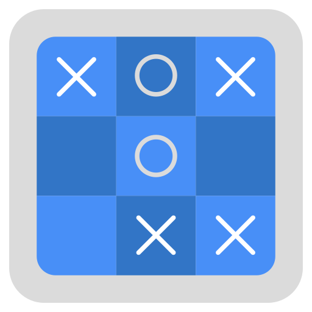

# Tic-Tac-Toe Game with AI (STM32)



This project implements a **Tic-Tac-Toe game** using an STM32 microcontroller, featuring both **human-player** and **AI player** modes. The game operates via UART communication, allowing users to input their moves through a serial terminal. The AI player makes decisions based on a predefined strategy.

---

## Features

- **Human vs AI**: The game allows a human player to play against an AI that makes strategic moves.
- **UART Communication**: Player inputs and game status updates are sent/received via UART.
- **AI Move Decision**: The AI player computes its move with a simulated delay.
- **User-friendly Input**: Users input their moves using standard coordinates (e.g., `a1`, `b3`).
- **Game Flow**: The game alternates between human and AI turns until either a player wins or the board is full.

---

## Table of Contents

1. [Introduction](#introduction)
2. [Hardware Requirements](#hardware-requirements)
3. [Software Requirements](#software-requirements)
4. [Setup Instructions](#setup-instructions)
5. [How to Play](#how-to-play)
6. [Code Explanation](#code-explanation)
7. [License](#license)

---

## Introduction

This project is a simple implementation of the **Tic-Tac-Toe** game, where a user plays against an AI using a microcontroller (STM32). The user interacts with the game through a **UART terminal**, providing their move as coordinates. The AI makes its move using a basic strategy and computes the next move with a slight delay to simulate decision-making time.

---

## Hardware Requirements

- **STM32 Microcontroller** (e.g., STM32F4 series)
- **USART Interface** (for UART communication with the terminal)
- **PC or Terminal** with a serial interface to interact with the STM32 via UART

---

## Software Requirements

- **IDE**: STM32CubeIDE or Keil uVision for compiling and flashing the firmware.
- **Libraries**: HAL (Hardware Abstraction Layer) libraries for STM32.
- **Serial Terminal**: Any terminal program that supports serial communication (e.g., PuTTY, Tera Term, or STM32CubeMonitor).
- **AI Algorithm**: Simple AI agent for move decision-making (based on predefined logic).

---

## Setup Instructions

### 1. Hardware Setup

- Connect the STM32 microcontroller to your PC via USB or serial port.
- Ensure that the USART pins (TX/RX) are properly connected to the serial terminal on your PC.
- The game will run in a loop, alternating between the user and the AI player.

### 2. Software Setup

1. **Install STM32CubeIDE**:
   - Download STM32CubeIDE from the official STMicroelectronics website.
   - Set up a new STM32 project targeting your specific STM32 microcontroller.

2. **Compile the Code**:
   - Open the provided code in STM32CubeIDE.
   - Make sure the UART peripheral is properly configured in the STM32CubeMX interface.
   - Include Libraries like "aifes.h" direct downloaded from the original repository <https://github.com/Fraunhofer-IMS/AIfES_for_Arduino/archive/refs/heads/main.zip>
   - Build the project.

3. **Flash the STM32**:
   - Flash the compiled firmware to your STM32 using STM32CubeIDE or a programmer (e.g., ST-Link).

4. **Connect to Serial Terminal**:
   - Open a serial terminal (e.g., PuTTY, Tera Term).
   - Set the baud rate (e.g., 9600), data bits (8), parity (None), stop bits (1), and flow control (None).
   - Connect to the appropriate COM port.
   - You can use **tic_tac_toe.py** as interface for our game (best choice)

---

## How to Play

0. **Connect the board / follow the previous step**:
   - Use command :

   ```python
      python tic_tac_toe.py
   ```


1. **Start the Game**:
   - Upon starting the game, the board will be printed to the serial terminal, and the AI will make its first move.

2. **User Input**:
   - The user is prompted to input their move in the format `a1`, `b3`, etc., where:
     - `a`, `b`, `c` represent the rows (1 to 3).
     - `1`, `2`, `3` represent the columns (1 to 3).
   - Example: If the user wants to place their mark on the bottom-left corner, they would type `c1` and press Enter.

3. **AI Move**:
   - After the user’s move, the AI will automatically choose a move and place its mark on the board. The AI’s move is computed using a predefined decision-making strategy.
   - The AI’s move and time spent making the decision will be printed to the terminal.

4. **Game End**:
   - The game will announce the winner or a draw once a player wins or the board is full.

---

## Code Explanation

### Key Functions

1. **`tictactoe_game()`**:
   - Main game loop, alternating turns between the human player and the AI.
   - Handles user input and validates coordinates (e.g., `a1`, `b3`).
   - Calls `run_ai_agent()` to compute the AI's move.
   - Prints the board state and messages to the terminal.

2. **`Serial_Print()`**:
   - Used to send messages and board updates to the UART terminal.
   - Displays game status, player moves, and AI's actions.

3. **`Serial_ReadChar()`**:
   - Reads a single character input from the UART terminal.
   - This function is used to capture the user’s move.

4. **`print_tictactoe_board()`**:
   - Displays the current state of the Tic-Tac-Toe board in a readable format on the serial terminal.

5. **AI Logic**:
   - The AI computes its move using basic logic (e.g., random valid moves or strategy-based).

6. **Time Measurement**:
   - Measures the time the AI takes to decide on a move using the `clock()` function, simulating decision-making time.

---

## License

This project is licensed under the MIT License - see the [LICENSE](LICENSE) file for details.

---

### Example of Terminal Interaction

```sh
############ New Game ############

Current Board:
  a1 | a2 | a3
  -----------
  b1 | b2 | b3
  -----------
  c1 | c2 | c3

Your turn: Please enter the coordinates (e.g. a3) you want to place an O and press >enter<
a1

Scelta fatta dall'Utente : a , 1

Current Board:
  O | a2 | a3
  -----------
  b1 | b2 | b3
  -----------
  c1 | c2 | c3

The AI took 15.000000 μs to think about the turn.
AIs turn was b2

Current Board:
  O | a2 | a3
  -----------
  b1 | X | b3
  -----------
  c1 | c2 | c3

```
